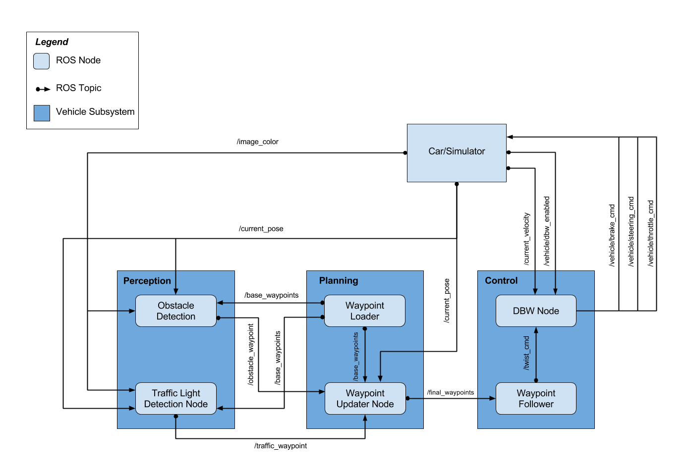
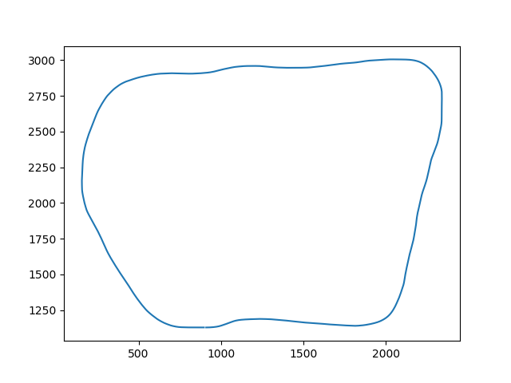
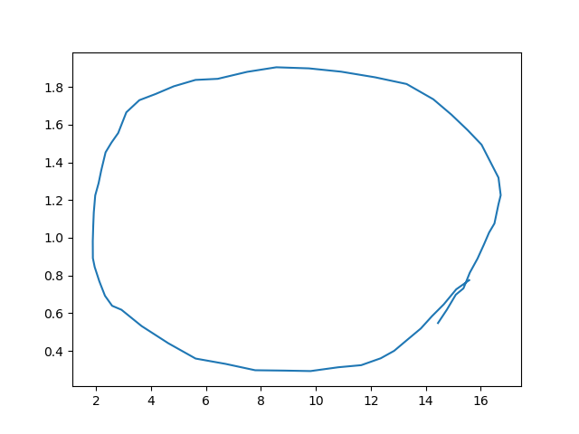

# Final Report Udacity Self Driving Nano-degree Capstone Project
### Don MacMillen 
### 3 January 2018

## Team Members

| Name | Contact | Location |
| ------------- |:-------------| :-----|
| Eric Kim | ericjkim9@gmail.com | Santa Clara, CA |
| Don MacMillen | don.macmillen@gmail.com | San Mateo, CA |
| Grigory Makarevich | grigorymakarevich@gmail.com | Seattle, WA |
| Stefan Gantner	| stefangantner@live.de | Munich, Germany |
| Karsten Schwinne | kschwinne@gmail.com | Dortmund, Germany |

## Credits

First off, to the team members listed above... thanks!

Secondly
  * Ideas for controllers: [DataSpeed ADAS Kit](https://bitbucket.org/DataspeedInc/dbw_mkz_ros)
  * Ideas for the "low budget" NN architecture from [tutorial](https://blog.keras.io/building-powerful-image-classification-models-using-very-little-data.html) by Francois Chollet
  * Udacity Forums and Slack channels

## Introduction

Strictly speaking, it doesn't look like a final report is a
requirement for the Capstone project, but if I don't write it down, it
will be forgotten forever. (I'm sure I have forgotten much already.) I will
not review much of the details that are outlined in the notes on
the system integration project. But here is a top level architectural
block diagram of the system taken from Udacity's project notes. However,
note that the obstacle detection was not implemented and was not a part
of the project.

## Waypoint Updater

The job of the waypoint updater is to first initialize the list of the waypoints
of the track (done by the call back waypoints_cb which listens to the topic
/base_waypoints that is published by the waypoint_loader), get the current pose (ie position)
of the car (pose_cb listening to /current_pose), get the location of the next
red light, if any (traffic_cb listening to /traffic_waypoint) and finally publish
a list of upcoming waypoints and their target velocities to the topic /final_waypoints.
The drive by wire process will listen to this topic and set the throttle, steering
angle, and braking force accordingly.

The basic insight into setting this up is that we have a very simple track
architecture for both tracks, that is, they are roughly equivalent to an oval.  
Here is a plot of the simulation track.

and here is a plot of the test track

Note that the test track waypoints overlap so I edited them down removing the
first 1 and the last four.  This allowed an unambiguous waypoint definition
so we could run multiple laps on the test track.

The angles to the 'center' of the track are single valued and we can
use them to keep track of position and waypoints, kind of like a poor
man's Frenet co-ordinates.  So we find the average x, y co-ordinates
of the track way points, make that the center, and then rotate the
co-ordinates so that the first track waypoint is at angle zero.
This allowed us to easily find the next waypoint that was in front of 
the vehicle's current (x, y) location.

Finally, the traffic light detection code only publishes traffic light info that
is 1) red or yellow and 2) is the next light in front of the current position of 
the car.  The waypoint updater looks at this and if the light is on and within the 
"braking_range", it sets all the desired velocities on the lookahead waypoints 
to zero. Otherwise, it sets all the desired velocities to the target velocity
and publishes these waypoints to the /final_waypoints topic

## Drive by Wire node

This node listens to the /final_waypoints topic and issues steering, throttle,
and braking commands to the topics /vehicle/steering_cmd, /vehicle/throttle_cmd,
and /vehicle/brake_cmd. To do this it needs the physical characteristics of the
car, such as mass, wheel base, wheel ratio, and maximums of the control variable.

The controller for the steering angle was provided in the starter code and it
performed OK. It is basically using proposed linear and angular velocities that
were generated by the waypoint_follower node and then using geometric approximations
to get a steering angle.  I found that a modified version of the geometric controls
seemed to perform slightly better and that is what is now enabled.

I also experimented with using a PID controller for the steering angle.  It was 
easy enough to calculate the cross track error (CTE) in the waypoint update node,
create a new ROS topic /cross_track_error and get the info over to the dbw node.
I used the PID parameter values from the PID project from the term 2 project.
Unfortunately, they did not perform well and trying to tune them with the broken,
wonky, simulator was next to impossible. Had this worked, we could have removed
the waypoint follower node.

Finally for the throttle control we used a cascade of two PID
controllers.  This was inspired by the DataSpeed dbw kit. Stage 1 took
the difference between the real and the desired velocity and only did
a proportional filter on that and bounded that between -9.8, 9.8 ie
1g.  You can think of that generated control as the error signal, but
it can also be viewed as an acceleration, which can be positive or
negative.

If the output of the first stage acceleration is negative, we skip the
second stage entirely and apply braking based on this acceleration,
the vehicle mass and the wheel radius. Often this result was capped by
the max acceleration which was set experimentally to not violate the
max accel and max jerk constraints.

If it was positive and we just used the output of the first stage
acceleration, we would be ignoring the fact that the car may already
be accelerating and therefore apply too much or too little throttle.

To fix that problem, we also calculate a finite difference
approximation to the current acceleration by subscribing to the 
/current_velocity topic and remembering the last velocity. Since this 
can be very noisy, we low pass filter it.

So finally, we reduce the first stage requested acceleration by the 
estimated (and filtered) current acceleration and use that as input to
the second stage PID controller to generate the throttle value.

## Traffic Light Detection Node

The job of the traffic light detection node is to publish the next red/yellow
light that is immediately in front of the car. Therefore it needs the
track waypoints, the current position, the configuration of all the traffic
lights, and the current image as seen by the car.  Most of the position tracking
and handling is the same as the waypoint updater node, so I will not 
discuss that here.

The team used a version of faster RCNN that was trained by Grigory in the project
submission. In the general case, we will need an object detection and recognition 
NN but here I wanted to try something a little different.

Since we have so much information about traffic lights locations given
to us by the simulator, we do not really need an object recognition
NN, only a classification NN.  The classification only needs to be
accurate if we are within a "braking_range" distance to the traffic
light, so errors from far away don't count. Also, since we have only 4
classes (red, green, yellow, unknown) we can probably train a small NN
to do that task. This is what I have done and included in this repo.

I used the first NN listed in the tutorial sited above but modified it
in several ways.  I first added another convolutional layer followed
by another max_pool layer to reduce the size of the output before adding
a layer flattening and a dense layer.  The final dense layer is of size 4 (for
the four classes).  I also removed the dropout layers, but added batch
normalization layer after every activation layer, based on the observations
of the original batch norm paper.

I used this with images that were one quarter size from the simulator,
that is, I used half size in each dimension. The resulting NN is tabulated
in the following table.

    _________________________________________________________________
    Layer (type)                 Output Shape              Param #   
    =================================================================
    conv2d_1 (Conv2D)            (None, 298, 398, 32)      896       
    _________________________________________________________________
    activation_1 (Activation)    (None, 298, 398, 32)      0         
    _________________________________________________________________
    batch_normalization_1 (Batch (None, 298, 398, 32)      128       
    _________________________________________________________________
    max_pooling2d_1 (MaxPooling2 (None, 149, 199, 32)      0         
    _________________________________________________________________
    conv2d_2 (Conv2D)            (None, 147, 197, 32)      9248      
    _________________________________________________________________
    activation_2 (Activation)    (None, 147, 197, 32)      0         
    _________________________________________________________________
    batch_normalization_2 (Batch (None, 147, 197, 32)      128       
    _________________________________________________________________
    max_pooling2d_2 (MaxPooling2 (None, 73, 98, 32)        0         
    _________________________________________________________________
    conv2d_3 (Conv2D)            (None, 71, 96, 32)        9248      
    _________________________________________________________________
    activation_3 (Activation)    (None, 71, 96, 32)        0         
    _________________________________________________________________
    batch_normalization_3 (Batch (None, 71, 96, 32)        128       
    _________________________________________________________________
    max_pooling2d_3 (MaxPooling2 (None, 35, 48, 32)        0         
    _________________________________________________________________
    conv2d_4 (Conv2D)            (None, 33, 46, 32)        9248      
    _________________________________________________________________
    activation_4 (Activation)    (None, 33, 46, 32)        0         
    _________________________________________________________________
    batch_normalization_4 (Batch (None, 33, 46, 32)        128       
    _________________________________________________________________
    max_pooling2d_4 (MaxPooling2 (None, 16, 23, 32)        0         
    _________________________________________________________________
    flatten_1 (Flatten)          (None, 11776)             0         
    _________________________________________________________________
    dense_1 (Dense)              (None, 32)                376864    
    _________________________________________________________________
    activation_5 (Activation)    (None, 32)                0         
    _________________________________________________________________
    batch_normalization_5 (Batch (None, 32)                128       
    _________________________________________________________________
    dense_2 (Dense)              (None, 4)                 132       
    =================================================================
    Total params: 406,276
    Trainable params: 405,956
    Non-trainable params: 320
    __________________________________________

I trained this NN on a data set of ~1100 images.  Some where from a set of ~280
that my mentor pointed me too.  Some were from Grigory's simulation training set.  
Grigory also extracted images from the rosbag of the test track, which
I also included. I found that I had to augment slightly for traffic
lights 5, 6, and 8.  I got these images by instrumenting the
tl_detector.py file.  It is easy to get labeled data this way, since
we are only classifying.  We just name the images with the light state
as returned by the simulator.

The final training was done from scratch, ie no transfer learning, for 200 epochs
with a batch size of 16.  The script to do this is in the scripts/train_keras.py
file.

The final size is only 3.3MB and performs well on the track and classifies all
the rosbag images correct, _but_ it is likely that it will not generalize well.

## ROS comments

I found ROS to be very easy to use and quite powerful.  It was easy to
add a topic for the cross track error. The downside is that I suspect
that ROS is not performant enough for many real world applications.

## Simulator issues

Where to start here? This was a major issue, a major productivity hit,
and a major heart-ache for all who had to use it. If you want to know
more, peruse the github issues, the slack channels and the
forums. Plenty of complaints there.
                     
                     
                     
                     
                     
                     
                     
                     
                     
                     
                     
                     
                     
                     
                     
                     
                     
                     
                     
                     
                     
                     
                     
                     
                     
                     
                     
                     
                     
                     
                     
                     
                     
                     
                     
                     
                     
                     
                         
                         
                         
                         
                         
                         
                         
                         
                         
                         
                         
                         
                         
                         
                         
                         
                         
                         
                         
                         
